# Multi-Agent Automation (MAA)

> A private project by Wesley Gan — a fully autonomous, multi-agent workflow orchestrator powered by GitHub Copilot SDK, LangGraph state management, Corrective RAG (CRAG), Arize Phoenix observability, and a modular on-demand Skills system.

---

## What Is This?

**MAA** transforms the traditional software development lifecycle by coordinating a pipeline of specialized AI agents — each owning a specific role — without any manual hand-offs between stages.

You describe a feature. The system does the rest.

```
You (PM Task) → BA → Tech Lead → QA → Developer → Architect → Security → DevOps → PM Sign-off
```

This repository is a **public showcase** of the project's architecture, design decisions, and capabilities. The full source code is maintained privately.

---

## The Problem It Solves

Modern AI coding tools help individual developers, but they don't solve the coordination problem:

- Requirements are still written manually
- Architectural decisions are still made in isolation
- QA still waits until after implementation
- Security reviews are often skipped or bolted on last-minute
- Knowledge transfer between roles is lossy and slow

MAA replaces this entire flow with an automated, role-aware agent pipeline that enforces quality gates at every stage.

---

## Key Features

| Feature | Description |
|---------|-------------|
| **3 Workflow Types** | Development (full feature), Spike (research/POC), Code Review (iterative loop) |
| **14+ Specialized Agents** | PM, BA, Tech Lead, Developer (stack-specific), QA, Architect, Security, DevOps, Researcher, and more |
| **LangGraph State Machine** | Workflow pipeline modelled as a typed `StateGraph` with formal reducers, thread-isolated checkpointing, and time-travel debugging |
| **Corrective RAG (CRAG)** | Five-node retrieval pipeline — query generator, retriever, LLM grader, query rewriter, executor — fetches only the most relevant reference docs per agent stage |
| **Arize Phoenix Observability** | Full OpenTelemetry tracing + heartbeat nodes — visualise every workflow → stage → LLM call → tool call span, with stall detection per graph node |
| **Dynamic Skills System** | 11 modular domain-knowledge packs (TDD, Security, Architecture, Code Review, etc.) injected only when relevant to the current agent + stage + workflow |
| **Automated Test Runner** | Independently executes the test suite after every developer implementation — agents cannot self-certify; the test runner verifies pass/fail directly |
| **AC-ID Coverage Verification** | Post-workflow script verifies every acceptance criterion from the BA BRD was mapped to a subtask, implemented, and covered by at least one test |
| **Developer File Guard** | Snapshots uncommitted developer files before QA/review stages and restores any files a QA agent destructively reverted |
| **Requirements Digest** | Extracts AC-IDs, architectural decisions, and file targets from BA + Tech Lead outputs into a compact digest injected into developer prompts |
| **Agent Question Log** | Agents surface questions/concerns to `docs/questions/` during execution — persisted for asynchronous human review |
| **Per-Role Model Routing** | 4-model routing strategy: Gemini 3.1 Pro (QA), GPT-5.3 Codex (Tech Lead), GPT-5.4 Mini (planning), Claude Sonnet 4.6 (implementation) |
| **Multi-Repository Support** | Switch between Next.js, NestJS, .NET, and Node.js/TypeORM projects with a single command |
| **LangGraph Checkpointing** | `FileSystemSaver` implements `BaseCheckpointSaver` — full checkpoint history per thread, resume from any prior state |
| **Subtask Orchestration** | Tech Lead auto-decomposes complex tasks into subtasks, each with their own QA → Dev → Review TDD cycle |
| **Interactive Corrections** | Type mid-workflow corrections to redirect agents without restarting |
| **Live Streaming Dashboard** | Real-time browser output at `localhost:3030` — watch agents work in real time |
| **Deferral Detection** | Detects when an agent tries to skip or defer work and forces re-execution |
| **Quality Gates** | Intent analysis validates output quality before passing context to the next agent |
| **Rate Limit Handling** | Automatic retry with exponential backoff for API rate limits |

---

## How It Works

### 1. You Write a PM Task

Create a `pm-task.md` defining the feature in plain language:

```markdown
## Feature: User Profile Page

### Description
Create a user profile page with avatar upload, bio editing, and activity history.

### Acceptance Criteria
- Users can view and edit their profile
- Avatar upload with image cropping
- Activity history with pagination
```

### 2. The Pipeline Runs Automatically

Each agent receives the output of the previous agent as context. No manual prompting required between stages.

```
PM_PRODUCT_DEFINITION  →  defines scope and success criteria
BA_REQUIREMENTS        →  produces a BRD with Gherkin user stories
TECH_LEAD_ASSESSMENT   →  architecture decisions + subtask breakdown
QA_TEST_CREATION       →  writes tests BEFORE implementation (TDD)
DEV_IMPLEMENTATION     →  implements features against the tests
QA_VALIDATION          →  validates implementation passes all tests
ARCHITECT_REVIEW       →  architecture review and recommendations
SECURITY_REVIEW        →  vulnerability and security assessment
DEVOPS_DEPLOYMENT      →  CI/CD and infrastructure configuration
PM_FINAL_APPROVAL      →  final review and sign-off
```

### 3. Output Is Structured and Auditable

Every agent produces structured output that flows into the next. The full pipeline run is logged and streamed live.

---

## Orchestrator & Agent Architecture

The `workflow-manager.js` orchestrator drives the system. The pipeline is modelled as a LangGraph `StateGraph`, context is retrieved per-stage via Corrective RAG, every LLM call is traced to Arize Phoenix, and agents receive on-demand domain knowledge from the Skills system.

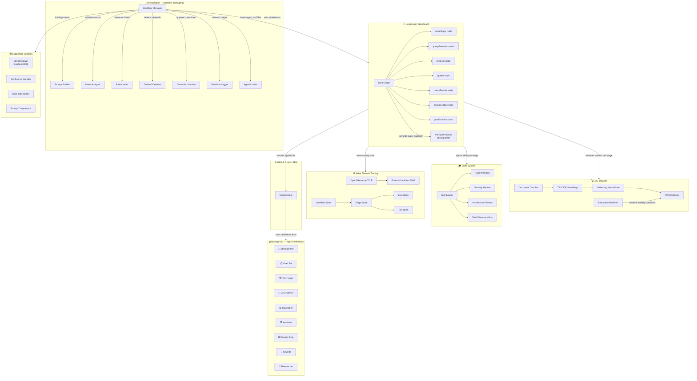

---

## Workflow Types

### Development Workflow

Full lifecycle pipeline for feature development. Runs 10 stages end-to-end. If the Tech Lead identifies a complex feature, it automatically decomposes it into subtasks — each with its own QA → Dev cycle — before the pipeline continues.

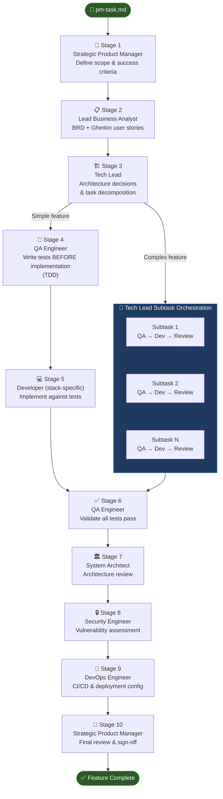

---

### Spike Workflow

Research-first pipeline for technical investigation and proof-of-concept work. Phases 3 runs Architect and Security analysis in parallel to maximise throughput.

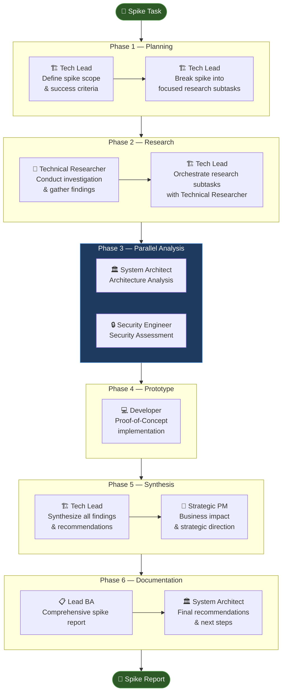

---

### Code Review Workflow

Self-improving iterative loop (up to 10 rounds). The Code Reviewer produces structured change requests; the Developer addresses each one. The loop exits on explicit approval or after 10 iterations.

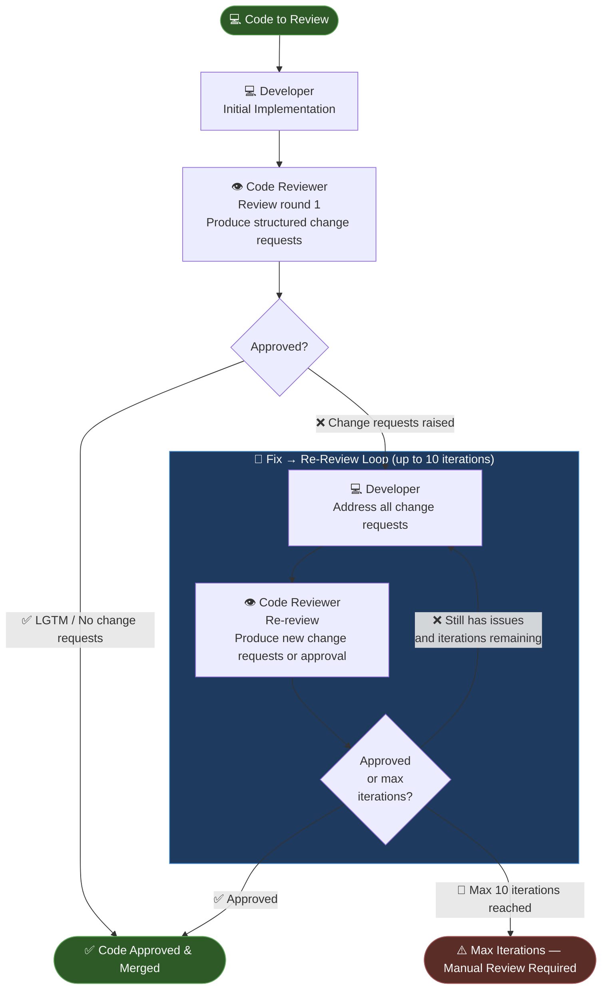

---

## Agent Roster

| Agent | Role |
|-------|------|
| Strategic Product Manager | Define requirements, acceptance criteria, final sign-off |
| Lead Business Analyst | BRD, user stories (Gherkin), spec quality gate |
| Tech Lead | Architecture decisions, task decomposition, subtask orchestration |
| QA Automation Engineer | TDD test creation and implementation validation |
| Senior Next.js Developer | Next.js App Router frontend implementation |
| Senior NestJS Developer | NestJS microservice development |
| Senior .NET Developer | .NET Core Web API development |
| Senior Node.js Developer | Node.js/Express/TypeORM backend development |
| System Architect | Architecture review and long-term recommendations |
| Security Engineer | Security assessment, vulnerability scanning |
| DevOps Engineer | CI/CD, deployment manifests, infrastructure |
| Technical Researcher | Spike research and technical investigation |
| Code Reviewer | Code quality, maintainability, best practices |
| Workflow Specialist | Workflow optimization and performance metrics |

Agents are defined as `.agent.md` files using VS Code's Copilot agent format, making them usable directly in the VS Code chat as well as within the automated pipeline.

---

## Multi-Repository Support

MAA is designed to operate against any target codebase. A central `repo-config.json` describes each project:

```json
{
  "activeRepo": "my-web-app",
  "repositories": {
    "my-web-app": {
      "stack": "nextjs",
      "agents": { "developer": "Senior Next.js Developer" },
      "instructions": ["nextjs.instructions.md", "reactjs.instructions.md"],
      "testCommand": "npm test"
    },
    "my-api": {
      "stack": "dotnet",
      "agents": { "developer": "Senior .NET Developer" },
      "instructions": ["dotnet.instructions.md", "csharp.instructions.md"]
    }
  }
}
```

Switching projects is a single command:

```powershell
.\switch-repo.ps1 -Repo my-api
.\run-workflow.ps1
```

### Supported Stacks

| Stack | Developer Agent |
|-------|----------------|
| Next.js | Senior Next.js Developer |
| NestJS | Senior NestJS Developer |
| .NET Core | Senior .NET Developer |
| Node.js + TypeORM | Senior Node.js TypeORM Developer |

---

## Coding Standards

Every agent is automatically loaded with the relevant coding standards for the active repository's stack. Standards are defined as `.instructions.md` files covering:

- Architecture patterns (hexagonal, clean, layered)
- Component and module conventions
- Testing strategy and coverage requirements
- Security and API design guidelines
- Git workflow and PR standards
- SCSS styling conventions

This ensures agents produce output that is idiomatic and consistent with the target project — not generic boilerplate.

---

## LangGraph State Machine

The entire workflow pipeline is modelled as a **LangGraph `StateGraph`** — replacing an ad-hoc plain-object pipeline with a formally typed, checkpointed, node-based graph.

### Graph Topology

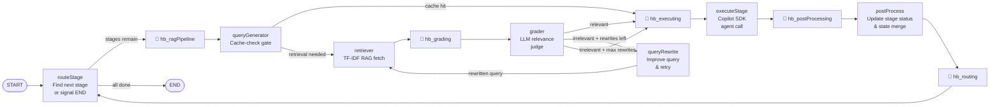

**Heartbeat nodes** (`hb_*`) are lightweight OpenTelemetry spans inserted at every major graph transition. If a Phoenix trace stalls, the last completed heartbeat pinpoints exactly which node is hung — no guesswork required.

### State Schema

The workflow state uses `Annotation.Root` — a typed channel system where every field has an explicit **reducer** controlling how partial updates are merged:

| Field | Reducer | Purpose |
|-------|---------|---------|
| `stages` | last-write-wins | Full stage array (mutated by dynamic injection) |
| `agentOutputs` | merge-objects | Keyed by agent+stageId — never overwrites prior outputs |
| `ragContext` | merge-objects | Per-stage retrieved context blocks |
| `ragQueriesCompleted` | append-list | Tracks which stages have been successfully retrieved |
| `corrections` | append-list | Human corrections queued mid-workflow |
| `retryContext` | last-write-wins | Rate-limit retry metadata |

### FileSystemSaver — Custom LangGraph Checkpointer

A custom `BaseCheckpointSaver` implementation persists the full checkpoint history per thread to disk as JSON. This enables:
- **Resume** from any prior checkpoint, not just the last
- **Time-travel debugging** — inspect the state at any stage in history
- **Thread isolation** — parallel workflow runs don't share state

```
langgraph-checkpoints/
  <thread-id>.json   ← array of { checkpoint, metadata, parentId, writes }
```

---

## Corrective RAG (CRAG) Pipeline

Every agent stage is enriched with the most relevant reference documentation via a **Corrective RAG** sub-graph embedded in the LangGraph workflow. Standard RAG retrieves blindly — CRAG retrieves, grades the result, and rewrites the query if the context is irrelevant.

### CRAG Flow

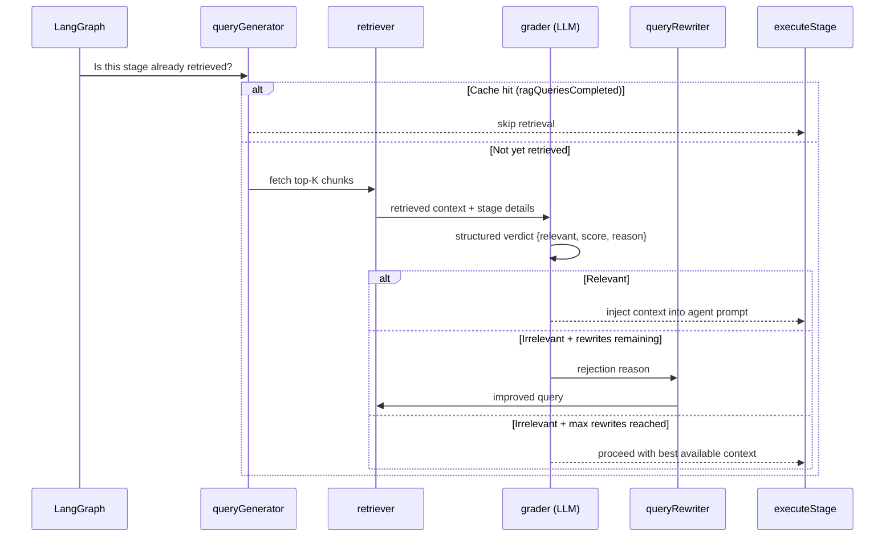

### RAG Implementation

| Component | Implementation |
|-----------|---------------|
| **Embeddings** | `TfIdfEmbeddings` — pure JS TF-IDF with stop-word filtering, zero external dependencies |
| **Vector Store** | `InMemoryVectorStore` — cosine similarity search, brute-force for corpora < 10k chunks |
| **Chunker** | `document-chunker.js` — Markdown-aware header-boundary splitting |
| **Retriever** | `RAGRetriever` — singleton, indexes at startup, retrieves per stage |
| **Instruction Retriever** | `instruction-retriever.js` — signal-map approach: detects tech stack from branch/task context and injects only the applicable coding standards |

The architecture is intentionally **pluggable** — swap `TfIdfEmbeddings` for `@huggingface/transformers` or OpenAI embeddings by implementing the same interface.

---

## Arize Phoenix Observability

Every workflow run is fully traced using **OpenTelemetry** with [**OpenInference**](https://github.com/Arize-ai/openinference) semantic conventions, exported to a local [**Arize Phoenix**](https://github.com/Arize-ai/phoenix) instance.

### Trace Hierarchy

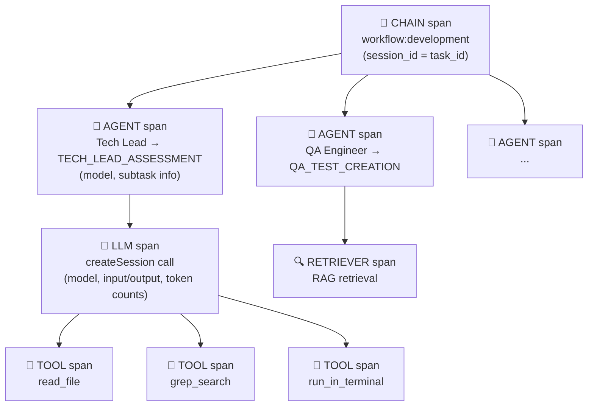

### What Each Span Captures

| Span type | Key attributes |
|-----------|---------------|
| Workflow (CHAIN) | `session.id`, `workflow.type`, `input.value` (task description) |
| Stage (AGENT) | `agent.name`, `llm.model_name`, subtask index, stage ID |
| LLM call | `llm.input_messages`, `llm.output_messages`, estimated token counts |
| Tool call | `tool.name`, `tool.parameters`, `output.value` |
| Retriever | Retrieved chunks, query, similarity scores |

### Viewing Traces

```powershell
# Start Phoenix UI (requires Arize Phoenix installed in .venv)
.\start-phoenix.ps1
# Opens http://localhost:6006
```

Override the collector endpoint via `PHOENIX_COLLECTOR_ENDPOINT` env var for remote Phoenix instances.

---

## Dynamic Skills System

**Skills** are modular, on-demand domain-knowledge packets. Unlike coding instructions (which are always-on rules loaded for the stack), skills are injected into an agent's prompt **only when relevant** — matched by agent role, stage type, and workflow type.

### Skill Activation

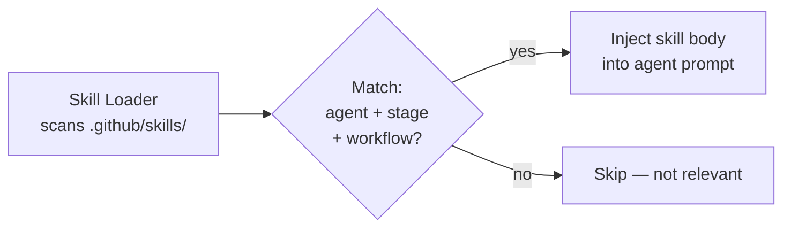

### Available Skills (10 packs)

| Skill | Agents | Stages |
|-------|--------|--------|
| **TDD Workflow** | QA Engineer | `QA_TEST_CREATION` |
| **Security Review** | Security Engineer | `SECURITY_REVIEW`, `SECURITY_ASSESSMENT` |
| **Architecture Review** | System Architect | `ARCHITECT_REVIEW`, `ARCHITECTURE_ANALYSIS` |
| **Task Decomposition** | Tech Lead | `TECH_LEAD_ASSESSMENT` |
| **Code Implementation** | All Developers | `DEV_IMPLEMENTATION`, subtask dev stages |
| **Requirements Analysis** | Lead BA | `BA_REQUIREMENTS` |
| **Product Definition** | Strategic PM | `PM_PRODUCT_DEFINITION` |
| **Review Decision** | Code Reviewer, Tech Lead | code review stages |
| **Technical Research** | Researcher, Tech Lead | spike research stages |
| **Deployment Readiness** | DevOps Engineer | `DEVOPS_DEPLOYMENT` |

### Skill File Format

```yaml
---
name: TDD Workflow
description: Red-Green-Refactor cycle guidance for QA stages
agents: [QA Automation Engineer]
stages: [QA_TEST_CREATION]
workflows: [development]
priority: 10
---

# Skill content — injected verbatim into the agent's prompt...
```

Skills are plain Markdown with YAML frontmatter — adding new domain knowledge requires creating one file, no code changes.

---

## Under The Hood — Engineering Depth

This is where MAA goes well beyond a simple "call agents in sequence" script. Several non-trivial problems had to be solved.

---

### Dynamic Pipeline — Stages Injected at Runtime

The workflow stage list is **not static**. After the Tech Lead completes its assessment, it can instruct the orchestrator to dynamically inject new subtask stages into the running pipeline — each with its own QA → Dev → Tech Review cycle — before the main pipeline resumes:

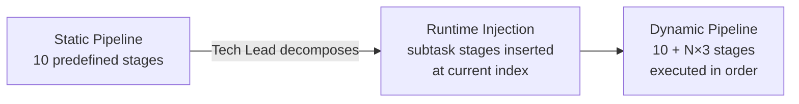

The injector resolves which developer agent to assign through **5 fallback tiers**: explicit tech-stack in control block → explicit agent name → `**Assigned Developer:**` pattern in Tech Lead output → persisted assignment from earlier stage → repo config default.

---

### Three-Tier Intent Routing

The Tech Lead's orchestration decisions are parsed through a three-tier strategy — tried in order until one succeeds:

| Tier | Method | How it works |
|------|--------|--------------|
| **1 — Explicit control block** | Structured JSON in output | Tech Lead emits a `WORKFLOW_CONTROL` JSON block; parsed directly |
| **2 — Natural language analysis** | Regex intent patterns | Detects phrases like _"returning to developer"_, _"code approved"_, _"orchestrating subtask 3"_ |
| **3 — Stage heuristics** | Rule-based fallback | Safe defaults based on stage type if no signal found in output |

This means agents don't need to produce perfectly structured output — the system understands natural language routing decisions.

---

### Spec-Kit: Human-in-the-Loop Clarification

The BA agent implements GitHub's Spec-Kit methodology. If requirements are ambiguous, the BA emits a structured clarification block and the **entire workflow pauses**:

```
<<<SPEC_KIT_CLARIFICATION>>>
QUESTIONS:
1. What is the expected behaviour when a user uploads a file > 10MB?
2. Should activity history persist after account deletion?
SEVERITY: blocking
CONTEXT: These gaps prevent writing accurate Gherkin acceptance criteria.
<<<END_SPEC_KIT_CLARIFICATION>>>
```

The orchestrator detects this signal, presents the questions in the terminal, waits for the user to type answers and `DONE`, then injects the answers as corrections and **re-runs the BA stage** with the clarified context. Up to 2 rounds allowed before the workflow proceeds anyway.

---

### Self-Healing Review Loops

When the Security Engineer or System Architect **rejects** a deliverable, the orchestrator doesn't just log the failure — it automatically injects a `TECH_LEAD_FIX` stage followed by a re-review stage into the live pipeline:

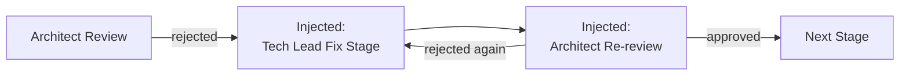

This loop is distinct from the subtask loop — fix-orchestration stages skip the QA → Dev cycle and escalate directly back to the reviewer.

---

### Context Management at Scale

Long pipelines accumulate large amounts of prior agent output as context. Two mechanisms prevent token limits from breaking later stages:

**1. Context offloading** — sections over 5KB (prior agent outputs, reference docs, repo structure) are written to disk and replaced with a file reference in the prompt. The agent reads the file via its tools rather than receiving it inline.

**2. LLMlingua compression pipeline** — if the prompt still exceeds 50KB after offloading, it is passed through a compression pipeline (LLMlingua → Grok) that reduces token count while preserving semantic meaning. Compression stats are logged per stage.

Both are transparent to the agents and require no changes to agent definitions.

---

### Model Routing Per Agent Role

Not all agents use the same model. The orchestrator routes each agent to the optimal model for its role:

| Agent | Model | Rationale |
|-------|-------|-----------|
| QA Automation Engineer | `gemini-3.1-pro` | Test creation & validation — precise, deterministic |
| Tech Lead | `gpt-5.3-codex` | Orchestration, task decomposition & code review |
| PM, BA, Security Engineer, Architect | `gpt-5.4-mini` | Planning, analysis & review — fast, lower cost |
| All Developers, DevOps, Researcher | `claude-sonnet-4.6` (default) | Code generation & implementation |

This is resolved per session via `model-selector.js` — the same pipeline uses up to 4 different models in a single run.

### Automated Test Runner — Trust Enforcement

Agents cannot self-certify their work. After every `DEV_IMPLEMENTATION` stage (including each subtask's dev stage), the test runner **independently executes the actual test suite** against the target repository:

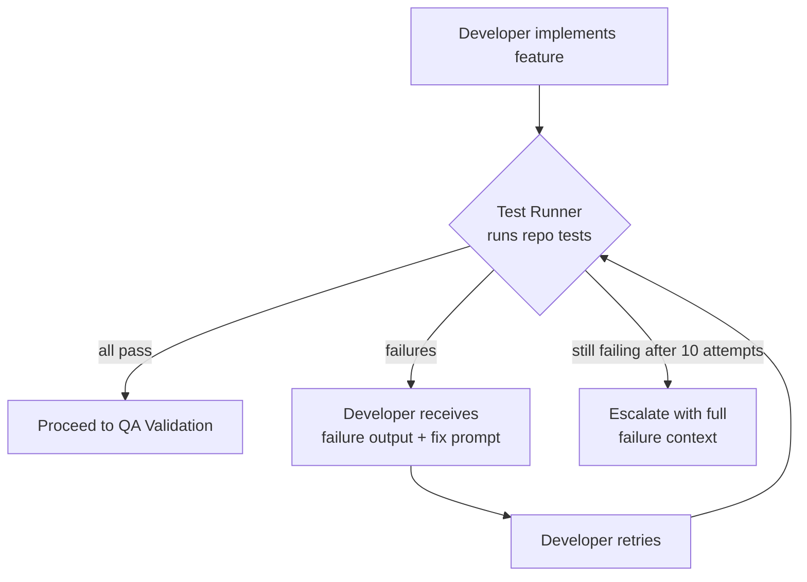

The test runner handles real-world messiness:
- **Auto-discovery** — finds the test setup even in nested monorepos by scanning for `package.json` and build scripts
- **Delegation detection** — follows `cd subdir && npm test` patterns in agent output
- **Error classification** — distinguishes infrastructure errors (ENOENT, EACCES) from real test failures, avoiding false retries on environment issues
- **Type-strip compatibility** — detects Node 22+ built-in TS stripping conflicts with project transpilers (ts-jest, tsx, ts-node) and adjusts flags
- **Circuit breaker** — detects repeated identical errors and stops retrying to avoid burning tokens on unfixable issues
- **Max retry cap** — 10 iterations maximum before escalating

---

### Developer File Guard

QA agents run git operations (`git restore`, `git clean`, `git checkout -- .`) to reset the working tree before running tests. This historically caused them to wipe uncommitted developer work, then falsely claim "the developer didn't implement anything."

The Dev Work Guard solves this by **snapshotting all uncommitted and untracked files before every QA or review stage**, then restoring any files the agent deleted:

```
Before QA stage:  Snapshot { path → Buffer } for all git-modified + untracked files
During QA stage:  QA agent runs normally (may run git restore)
After QA stage:   Diff snapshot vs current state → restore any missing/reverted files
```

No git commits required. The developer's work is always preserved.

---

### AC-ID Coverage Verification

After a workflow completes, the coverage verifier cross-checks that the pipeline delivered what it promised:

```
BA BRD  →  AC-IDs extracted  →  Verify each AC-ID was:
                                  1. Mapped to a subtask by Tech Lead
                                  2. Implemented in target codebase (grep)
                                  3. Covered by at least one test
```

```powershell
npm run verify:coverage          # Standard report
npm run verify:coverage:verbose  # Full detail per AC-ID
```

Gaps are reported per AC-ID so any missed requirements are immediately actionable.

---

### Requirements Digest

Instead of cascading full multi-KB agent outputs into every developer prompt (which bloats context and buries the signal), the Requirements Digest **extracts and compresses exactly what a developer needs**:

- Every **AC-ID** from the BA BRD with its description
- **Architectural decisions** from the Tech Lead (file locations, patterns, conventions)
- **Target files** the Tech Lead specified
- **Constraints** (what NOT to change, backward compatibility rules)
- For subtasks: a **prior subtask summary** (what was already implemented)

This replaces hundreds of lines of prose with a focused structured block — injected directly above the test spec in the developer's prompt.

---

### Agent Question Log

Agents surface questions, assumptions, and concerns as a structured log during execution, persisted to `docs/questions/<taskId>-questions.md`. This gives reviewers a post-run record of where agents were uncertain — without blocking workflow execution.

---

## Advanced Capabilities

### Checkpoint & Resume
Every completed stage is checkpointed to disk. If a workflow is interrupted (network issue, rate limit, or manual stop), resume exactly where it left off:

```powershell
.\run-workflow.ps1 -Resume
```

### Interactive Corrections
While the pipeline is running you can type a correction into the terminal. The correction handler queues it and injects it as context for the next agent — no restart required.

### Deferral Detection
Agents sometimes produce outputs like _"I'll leave this for the developer..."_. The deferral detector identifies these patterns and forces the agent to complete its assigned responsibility before passing control forward.

### Intent Analysis (Quality Gates)
After each agent completes, an intent analyzer validates output quality against the expected stage deliverables. Low-quality or incomplete outputs are flagged before context is passed to the next agent.

---

## GitHub Copilot SDK Integration

MAA is built directly on top of the `@github/copilot-sdk` — the programmatic interface to GitHub Copilot's model and tool execution layer. This is what makes fully automated, headless agent execution possible without any UI interaction.

### How the SDK Is Used

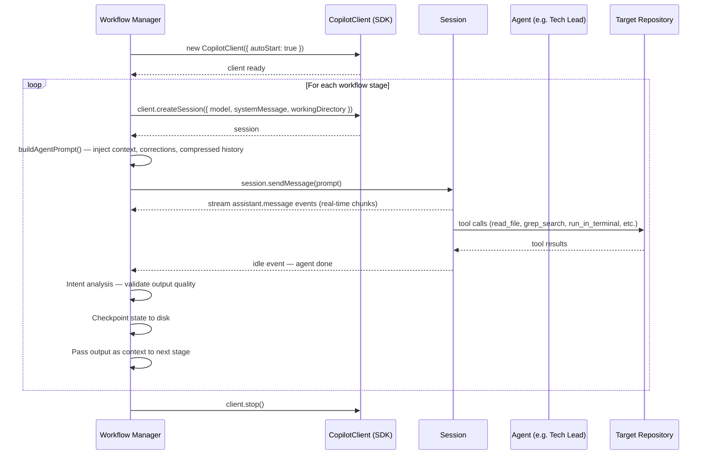

### Key SDK Interactions

| Interaction | Details |
|-------------|---------|
| **Session per agent** | Each pipeline stage creates a fresh `client.createSession()` with the agent's system message injected as `type: "replace"` |
| **Model selection** | Planning/analysis agents (PM, BA, Tech Lead, Architect) use `grok-code-fast-1`; implementation agents use `claude-sonnet-4.6` |
| **Working directory** | Set to the target repository path so file tools operate on the correct codebase |
| **Streaming** | `assistant.message` events deliver content chunks in real-time; forwarded to the live dashboard and terminal |
| **Idle detection** | `idle` event signals the agent has finished all tool calls and produced its final output |
| **Tool access** | Agents call VS Code Copilot tools (`read_file`, `grep_search`, `semantic_search`, `run_in_terminal`, etc.) to interact with the codebase |

### Why the SDK vs. Chat UI

Using the SDK directly lets the orchestrator:
- **Drive agents programmatically** — no human needs to press send between stages
- **Inject dynamic context** — prior agent outputs, corrections, and compressed history are assembled per-stage before the prompt is sent
- **React to events** — idle detection, tool call counting, and checkpoint triggers are all event-driven
- **Apply quality gates** — intent analysis runs on the raw output before any context is forwarded

---

## Technology Stack

| Component | Technology |
|-----------|------------|
| Runtime | Node.js 18+ (ESM) |
| AI SDK | `@github/copilot-sdk` v0.1.23 |
| State Machine | `@langchain/langgraph` v1.2 — typed `StateGraph` with custom `BaseCheckpointSaver` |
| RAG Embeddings | TF-IDF (pure JS, zero dependencies) — pluggable interface |
| Observability | Arize Phoenix + OpenTelemetry OTLP (`@opentelemetry/sdk-trace-node`) |
| OpenInference | `@arizeai/openinference-semantic-conventions` |
| Models | Gemini 3.1 Pro (QA), GPT-5.3 Codex (Tech Lead), GPT-5.4 Mini (planning), Claude Sonnet 4.6 (default) |
| Scripting | PowerShell 7 |
| Live Streaming | Node.js HTTP server + Server-Sent Events |
| Agent Definitions | VS Code `.agent.md` format |
| Configuration | JSON with JSON Schema validation |

---

## Project Structure

```
MAA/
├── workflow-manager.js            # Core orchestrator (lean entrypoint)
├── workflow-specialist-agent.js   # Workflow analysis & metrics
├── workflow-logger.js             # Structured logging + live streaming
├── checkpoint-utils.js            # Legacy checkpoint utilities
│
├── workflows/
│   ├── development-workflow.js    # Full 10-stage feature pipeline
│   ├── spike-workflow.js          # Research & PoC pipeline
│   ├── code-review-workflow.js    # Iterative review loop
│   └── shared/
│       ├── deferral-detector.js   # Agent deferral detection
│       ├── rate-limiter.js        # Exponential backoff retry
│       └── state-manager.js       # Workflow state I/O
│
├── lib/                           # Modular engine components
│   ├── lifecycle/                 # 🔄 Startup & shutdown (new_version)
│   │   ├── workflow-initializer.js # SDK, tracing, agents, skills init
│   │   └── signal-handler.js      # Graceful SIGINT/SIGTERM shutdown
│   ├── stage/                     # 🎮 Per-stage operations (new_version)
│   │   ├── post-stage-router.js   # All post-stage routing logic
│   │   ├── test-runner.js         # Automated test execution & retry
│   │   ├── dev-work-guard.js      # Snapshot/restore developer files
│   │   ├── subtask-validator.js   # Subtask progression enforcement
│   │   └── question-logger.js     # Agent question persistence
│   ├── execution/                 # 💻 SDK session lifecycle (new_version)
│   │   ├── session-handler.js     # Copilot SDK session & streaming
│   │   ├── checkpoint-handler.js  # Periodic & emergency checkpoints
│   │   └── debug-utils.js         # Debug file naming & saving
│   ├── langgraph/                 # 🔗 LangGraph integration
│   │   ├── workflow-graph.js      # StateGraph definition + edge wiring
│   │   ├── state-annotation.js    # Typed state channels with reducers
│   │   ├── rag-nodes.js           # CRAG: queryGenerator, retriever, grader, rewriter
│   │   ├── heartbeat-nodes.js     # OTel heartbeat spans between graph nodes
│   │   ├── file-checkpointer.js   # FileSystemSaver (BaseCheckpointSaver impl)
│   │   └── langgraph-state-manager.js  # Drop-in state manager API
│   ├── rag/                       # 🔍 RAG pipeline
│   │   ├── rag-retriever.js       # Singleton RAGRetriever (index + retrieve)
│   │   ├── vector-store.js        # InMemoryVectorStore (cosine similarity)
│   │   ├── text-embeddings.js     # TfIdfEmbeddings (pure JS)
│   │   ├── document-chunker.js    # Markdown-aware document chunking
│   │   └── instruction-retriever.js    # Dynamic coding standards via signal-map
│   ├── tracing/                   # 📊 Arize Phoenix observability
│   │   └── phoenix-tracer.js      # OTel OTLP exporter + OpenInference spans
│   ├── skills/                    # 🎓 Skills system
│   │   └── skill-loader.js        # Load & match skills to agent+stage+workflow
│   ├── agents/
│   │   ├── agent-loader.js        # Loads agent definitions from .agent.md files
│   │   └── model-selector.js      # Per-agent model routing (4 models)
│   ├── prompt/
│   │   ├── prompt-builder.js      # Builds agent prompts with context
│   │   ├── requirements-digest.js # Compact BA+TL digest for developer prompts
│   │   ├── prompt-compressor.js   # LLMlingua compression pipeline
│   │   └── prompt-extractor.js    # Extracts next-agent prompts from output
│   ├── context/context-loader.js  # Reference doc caching & loading
│   ├── intent/intent-analyzer.js  # Output quality + NLU routing
│   ├── orchestration/             # Tech Lead subtask management
│   ├── interactive/               # Mid-workflow corrections
│   └── spec-kit/                  # BA requirements quality gate
│
├── langgraph-checkpoints/         # Per-thread checkpoint JSON files
│
├── scripts/
│   ├── verify-ac-coverage.js      # Post-workflow AC-ID coverage verification
│   ├── render-mermaid-diagrams.js # Render diagrams to PNG
│   └── workflow-automation/       # PowerShell workflow automation scripts
│
├── .github/
│   ├── agents/                    # 14+ agent definitions (.agent.md)
│   ├── skills/                    # 11 domain skill packs (SKILL.md)
│   ├── instructions/              # Stack-specific coding standards
│   ├── prompts/                   # Reusable prompt templates
│   ├── chatmodes/                 # Custom VS Code chat modes
│   └── runbooks/                  # Workflow runbooks
│
├── docs/questions/                # Agent question logs (auto-generated)
├── repo-config.json               # Multi-repository configuration
├── repo-config.schema.json        # Config JSON Schema
├── run-workflow.ps1               # Workflow launcher
├── switch-repo.ps1                # Repository switcher
├── start-streaming.ps1            # Live dashboard launcher
└── start-phoenix.ps1              # Arize Phoenix UI launcher
```

---

## Design Decisions

**Why a test runner instead of trusting agents?**  
Agents will claim their code passes tests without running them, or selectively report partial results. An independent test runner that executes the actual test suite eliminates this entirely — the score comes from the real test output, not the agent's narration.

**Why a developer file guard?**  
QA agents legitimately need a clean git working tree to reset and re-run tests. Without the guard, they reset it — wiping uncommitted developer work — then falsely declare nothing was implemented. Snapshotting before and restoring after gives QA the clean state it needs without destroying developer progress.

**Why AC-ID coverage verification?**  
The pipeline produces a lot of output but the question that matters is whether every acceptance criterion actually got implemented and tested. The verifier gives a binary, traceable answer per AC-ID rather than relying on agents to self-report completeness.

**Why heartbeat nodes in the LangGraph graph?**  
Long-running agent sessions can take minutes. Without heartbeats, a stalled Phoenix trace shows a span that started but never ended — impossible to tell which node is hung. Heartbeat spans complete instantly and mark each transition, so the last finished heartbeat identifies the exact failure point.

**Why GitHub Copilot SDK?**  
The SDK provides direct, programmatic access to Copilot's model routing and tool execution, allowing the orchestrator to drive agents without UI interaction.

**Why LangGraph for state management?**  
A plain pipeline object works until you need typed reducers, concurrent thread isolation, checkpoint history, and time-travel debugging. LangGraph's `StateGraph` provides all of them as first-class primitives. The custom `FileSystemSaver` means zero external infra — checkpoint history lives on disk.

**Why Corrective RAG instead of always injecting all docs?**  
Naively injecting every reference document into every prompt wastes tokens and degrades output quality with irrelevant context. CRAG ensures agents only receive the specific documentation relevant to their exact stage and task, and rewrites the query when the first retrieval misses.

**Why TF-IDF and not neural embeddings for RAG?**  
Technical documentation is keyword-rich — agent role names, library names, method names — where lexical matching is highly effective and often on par with dense embeddings. TF-IDF runs in milliseconds with zero model downloads, API keys, or GPU requirements. The interface is pluggable: swapping in neural embeddings requires one implementation change.

**Why Arize Phoenix for observability?**  
Phoenix is the leading open-source LLM observability platform. Using the OpenInference semantic conventions ensures traces are structured in a way that any OpenTelemetry-compatible backend (Phoenix, Jaeger, Honeycomb) can consume. Span nesting gives a full causal chain: workflow → stage → LLM call → tool call.

**Why a Skills system instead of larger agent prompts?**  
Static, large prompts accumulate irrelevant content over time. A skill system keeps each agent definition minimal and composable — the Security Engineer's OWASP checklist is only injected when the Security Engineer is actually running a security stage, not in every single prompt.

**Why PowerShell for the launcher?**  
Cross-platform PowerShell 7 provides a familiar scripting surface on Windows-first development environments while remaining portable to Linux/macOS.

**Why `.agent.md` for agent definitions?**  
VS Code's native agent format means every agent can be used interactively in the VS Code chat panel — the same definitions that power the automated pipeline are also available as first-class chat participants during ad-hoc development.

---

## Author

**Wesley Gan** — Software Engineer & AI Automation Enthusiast  
GitHub: [@wesleygan89](https://github.com/wesleygan89)

This project demonstrates how multi-agent orchestration can transform the software development lifecycle — from requirements gathering to deployment — using AI agents with specialized roles, structured workflows, and enforced quality gates.

---

## License

MIT — see [LICENSE](LICENSE) for details.
